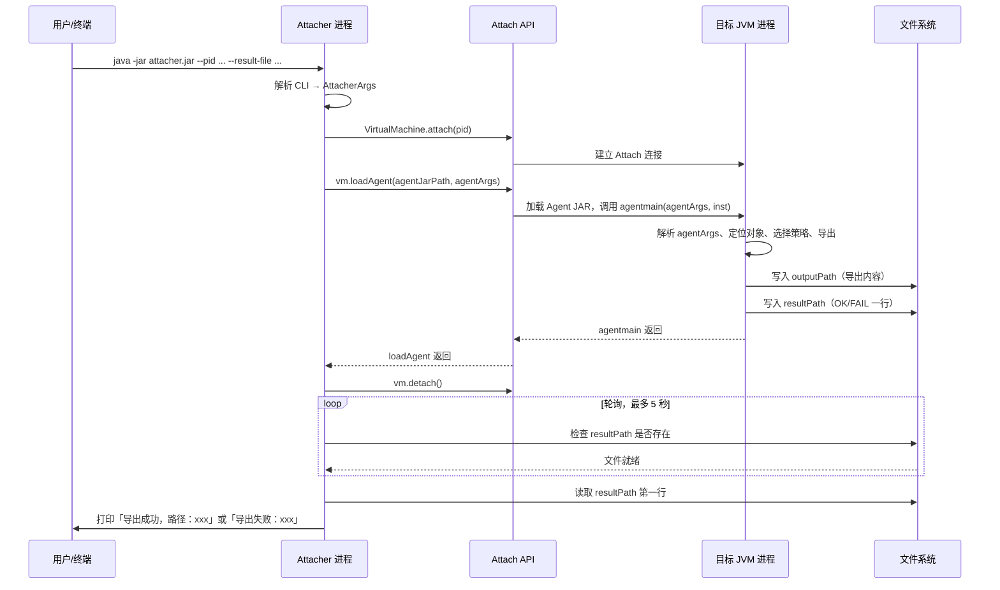

# Agent 与 Attacher 设计文档

本文档描述 arthas-tools 中 **Agent** 与 **Attacher** 的职责划分、整体架构以及进程之间的交互关系。

---

## 1. Agent 与 Attacher 的区别与职责

### 1.1 一句话对比

| 角色 | 运行位置 | 主要职责 |
|------|----------|----------|
| **Attacher** | 独立进程（用户执行 `java -jar attacher.jar` 的进程） | 解析 CLI、附加到目标 JVM、加载 Agent JAR、等待并展示结果 |
| **Agent** | 目标 JVM 进程内（被注入后在其内执行） | 解析参数、定位对象、导出缓存内容、写文件并反馈结果 |

### 1.2 Attacher 详细职责

Attacher 是一个 **独立的可执行 JAR**（`Main-Class: com.github.bingooyong.arthas.attacher.Main`），运行在**当前终端所在的 JVM 进程**中：

1. **解析命令行参数**  
   使用 `CliParser` 解析 `--pid`、`--class`、`--field`/`--method`、`--output`、`--agent-jar`、`--result-file`，得到 `AttacherArgs`。

2. **附加到目标 JVM**  
   通过 JDK 的 **Attach API**（`com.sun.tools.attach.VirtualMachine`）根据 PID 附加到目标进程：
   - `VirtualMachine.attach(String.valueOf(pid))`
   - 成功后获得 `VirtualMachine` 实例。

3. **加载 Agent**  
   调用 `vm.loadAgent(agentJarPath, agentArgs)`：
   - 将 Agent JAR 路径与一串 `agentArgs` 传给目标 JVM；
   - 目标 JVM 会加载该 JAR，并调用其 MANIFEST 中声明的 `Agent-Class` 的 `agentmain(agentArgs, Instrumentation)`。

4. **等待并读取结果**  
   Attacher 不通过 socket 或管道与 Agent 通信，而是约定 Agent 将执行结果写入 **结果文件**（`--result-file` 指定路径）。Attacher 使用 `ResultFileReader` 轮询该文件（默认超时 5 秒），读取第一行：
   - `OK <outputPath>` → 打印「导出成功，路径：xxx」
   - `FAIL <message>` → 打印「导出失败：xxx」

5. **脱离目标 JVM**  
   在 `loadAgent` 之后执行 `vm.detach()`，与目标进程解除附加关系。

**总结**：Attacher 是「发起方」和「结果展示方」，不接触目标进程内的业务数据，只负责附加、加载 Agent、传参，以及通过结果文件获取执行反馈。

### 1.3 Agent 详细职责

Agent 是一个 **被 Attacher 注入到目标 JVM 的 JAR**（MANIFEST 中 `Agent-Class: com.github.bingooyong.arthas.agent.CacheExportAgent`），其代码在**目标进程内**执行：

1. **入口**  
   JVM 在加载 Agent JAR 后调用：
   `CacheExportAgent.agentmain(String agentArgs, Instrumentation inst)`  
   并传入 Attacher 在 `loadAgent(agentJarPath, agentArgs)` 中提供的 `agentArgs` 字符串。

2. **解析 agentArgs**  
   `AgentArgsParser` 将 `agentArgs` 解析为 `AgentArgs`（格式约定见下文「契约」）。校验失败时向结果路径写入 `FAIL <reason>` 并返回。

3. **定位目标对象**  
   `TargetLocator` 根据「类名 + 静态字段名或静态无参方法名」在目标 JVM 内通过反射获取对象（Map/List/Set/Collection/数组等）。

4. **选择策略并导出**  
   `ExportStrategyRegistry` 根据目标对象类型选择对应导出策略（Map/List/Set/Collection/数组），将内容序列化到 `StringBuilder`。

5. **写文件与反馈**  
   - 将导出内容写入 `outputPath`（`--output` 对应路径）；
   - 将一行结果写入 `resultPath`（`--result-file` 对应路径）：
     - 成功：`OK <outputPath>`
     - 失败：`FAIL <message>`

6. **异常与安全**  
   整个执行过程在 `AgentBootstrap.run()` 中由 try/catch 包裹，确保异常不向外抛出，避免影响目标 JVM 的 Agent 加载线程；失败时尽量将 `FAIL` 写入结果文件，供 Attacher 读取。

**总结**：Agent 是「执行方」，运行在目标进程内，直接访问该进程的堆内存（反射读静态字段/调用静态方法），完成缓存导出并写文件；与 Attacher 的协作仅通过**约定好的 agentArgs 字符串**和**结果文件**完成，无网络或管道通信。

---

## 2. 整体架构

### 2.1 模块划分

```
arthas-tools/
├── agent/          # Agent 模块：被注入目标 JVM，执行导出逻辑
├── attacher/       # Attacher 模块：CLI 进程，附加并加载 Agent
├── demo/            # 演示/验收用目标进程（可选）
└── docs/            # 文档（含本文档）
```

### 2.2 构建产物与运行形态

| 产物 | 模块 | 说明 |
|------|------|------|
| `agent/target/arthas-tools-agent-*.jar` | agent | Agent JAR，含 `Agent-Class`，无第三方依赖，由 Attacher 指定路径加载 |
| `attacher/target/arthas-tools-attacher-*-runnable.jar` | attacher | 可执行 JAR，含 Main-Class 及依赖（如 JDK8 的 tools.jar），用户直接 `java -jar` 运行 |

### 2.3 Attacher 内部结构（简图）

```
Main.main(args)
    │
    ├─► CliParser.parseOrExit(args)  → AttacherArgs
    │
    ├─► AttachRunner.attachAndLoad(attacherArgs)
    │       │
    │       ├─► AgentArgsBuilder.build(args)  → agentArgs 字符串
    │       ├─► VirtualMachine.attach(pid)
    │       ├─► vm.loadAgent(agentJarPath, agentArgs)
    │       └─► vm.detach()
    │
    └─► ResultFileReader.waitAndPrintFeedback(resultFilePath)
            └─► 轮询结果文件，解析 OK/FAIL，打印中文反馈
```

### 2.4 Agent 内部结构（简图）

```
CacheExportAgent.agentmain(agentArgs, inst)
    │
    └─► AgentBootstrap.run(agentArgs, inst)
            │
            ├─► AgentArgsParser.parseAndValidate(agentArgs)  → AgentArgs
            ├─► TargetLocator.locate(class, field/method)    → 目标对象
            ├─► ExportStrategyRegistry.selectStrategy(target) → ExportStrategy
            ├─► strategy.export(target, content)
            └─► ResultWriter.writeSuccess(content, outputPath, resultPath)
                    或异常时 ResultWriter.writeFailure(resultPath, message)
```

---

## 3. 进程之间的交互关系

### 3.1 进程角色

- **进程 A（Attacher 进程）**  
  用户执行 `java -jar arthas-tools-attacher-*-runnable.jar ...` 的 JVM 进程。只运行 attacher 的代码，不运行业务逻辑。

- **进程 B（目标 JVM 进程）**  
  被导出的业务应用所在进程，由 `--pid` 指定。其内原本没有 Agent 代码；在被 Attach 并 `loadAgent` 后，会**临时**加载 Agent JAR 并执行 `agentmain`，执行完毕后 Agent 类仍留在目标 JVM 中，但不再被主动调用。

- **文件系统**  
  作为 Attacher 与 Agent 之间**唯一的间接通信媒介**（除 Attach API 自带的 loadAgent 传参外）：
  - **结果文件**（`--result-file`）：Agent 写入一行 `OK/FAIL`，Attacher 轮询读取；
  - **输出文件**（`--output`）：Agent 将导出内容写入该文件，Attacher 不直接读该文件，仅通过结果行中的 `OK <outputPath>` 提示用户。

### 3.2 交互时序（概览）

以下 Mermaid 时序图概括 Attacher、目标 JVM 与文件系统之间的交互：



文字时序简述：

```
  Attacher 进程 (A)                    目标 JVM 进程 (B)                    文件系统
        │                                    │                                    │
        │  1. 解析 CLI，得到 pid、agentJar、agentArgs 等                          │
        │  2. VirtualMachine.attach(pid) ────► 建立 Attach 连接                    │
        │  3. vm.loadAgent(agentJar, agentArgs) ────────────────────────────────►  │
        │                                    │  加载 Agent JAR                    │
        │                                    │  调用 agentmain(agentArgs, inst)   │
        │                                    │  4. 解析、定位、导出、写文件 ──────────────► 写 outputPath
        │                                    │  5. 写 resultPath ──────────────────────────► 写 resultPath
        │                                    │  6. agentmain 返回                  │
        │  7. loadAgent 返回                  │                                    │
        │  8. vm.detach()                     │                                    │
        │  9. 轮询 resultPath ◄──────────────────────────────────────────────────── 读 resultPath
        │ 10. 解析 OK/FAIL，打印反馈            │                                    │
        ▼                                    ▼                                    ▼
```

说明：

- 步骤 2–3：仅 Attach API 与目标 JVM 交互，将 Agent JAR 和 `agentArgs` 传入目标进程。
- 步骤 4–5：Agent 在目标进程内访问堆内存、写本地文件；**同一台机器**上 Attacher 与目标进程看到的文件系统一致，故 resultPath 和 outputPath 对两进程是同一路径。
- 步骤 9：Attacher 不依赖 Agent 进程「退出」或「关闭连接」，只依赖**结果文件出现且内容就绪**，因此采用轮询 + 超时。

### 3.3 数据流与契约

#### 3.3.1 agentArgs 格式（Attacher → Agent）

由 Attacher 的 `AgentArgsBuilder.build(AttacherArgs)` 生成，通过 `loadAgent(agentJarPath, agentArgs)` 传给 Agent。  
约定：**key=value**，多对之间用 **`&`** 分隔。

- 必选键：`class`、`outputPath`、`resultPath`
- 二选一：`field` 或 `method`（不能同时、不能都缺）

示例：

```
class=com.example.Cache&field=map&outputPath=/tmp/out.txt&resultPath=/tmp/result.txt
```

或使用方法：

```
class=com.example.ConfigHolder&method=getKeys&outputPath=/var/run/export/keys.txt&resultPath=/var/run/export/result.txt
```

Agent 端由 `AgentArgsParser.parseToMap` / `parseAndValidate` 解析，与 Attacher 的 `AgentArgsBuilder` 必须保持一致。

#### 3.3.2 结果文件格式（Agent → Attacher）

- **路径**：即 `resultPath`（对应 CLI 的 `--result-file`）。
- **内容**：单行 UTF-8 文本，两种形式：
  - 成功：`OK <outputPath>`（outputPath 即导出文件路径）
  - 失败：`FAIL <message>`

Attacher 的 `ResultFileReader` 只读第一行，根据是否以 `OK ` 或 `FAIL ` 开头决定提示「导出成功，路径：xxx」或「导出失败：xxx」。

#### 3.3.3 超时与轮询

- Attacher 在 `loadAgent` 返回后开始轮询结果文件，默认超时 **5 秒**，轮询间隔 200ms。
- 若超时仍未看到结果文件或无法解析，打印「导出失败：未收到结果（超时）」。

---

## 4. 与 JDK Attach / Instrumentation 的关系

- **Attach API**（`com.sun.tools.attach`）  
  由 **Attacher 进程**使用，用于附加到目标 JVM 并执行 `loadAgent`。JDK 8 中该 API 位于 `tools.jar`，需在 classpath；JDK 9+ 在 `jdk.attach` 模块中。

- **Instrumentation**  
  由 **目标 JVM** 在加载 Agent 时传入 `agentmain(agentArgs, Instrumentation inst)`。本工具当前仅用 Agent 做「定位 + 导出」，未使用 `inst` 做字节码增强；保留该参数符合 Java Agent 规范，便于后续扩展。

- **Agent 加载方式**  
  本工具采用 **动态附加**（运行时 `loadAgent`），因此只实现 `agentmain`，不实现 `premain`（premain 用于 JVM 启动时 `-javaagent` 方式）。

---

## 5. 小结

| 维度 | Attacher | Agent |
|------|----------|--------|
| 运行进程 | 独立进程（用户执行的 JVM） | 目标业务进程（被附加的 JVM） |
| 入口 | `Main.main` → CLI | `CacheExportAgent.agentmain` |
| 输入 | 命令行参数 | agentArgs 字符串 + Instrumentation |
| 对目标进程 | 仅 Attach + loadAgent，不读堆 | 反射读堆、写文件 |
| 与对方的通信 | 通过结果文件轮询读取 | 通过写 resultPath 与 outputPath |
| 产物 | 可执行 JAR（含依赖） | Agent JAR（仅 JDK，Agent-Class） |

两者通过 **Attach API 的 loadAgent(agentJarPath, agentArgs)** 建立「一次性的参数传递」，通过 **结果文件** 实现「执行结果的回传」，无长连接或 RPC，结构清晰、易于部署和排查。
